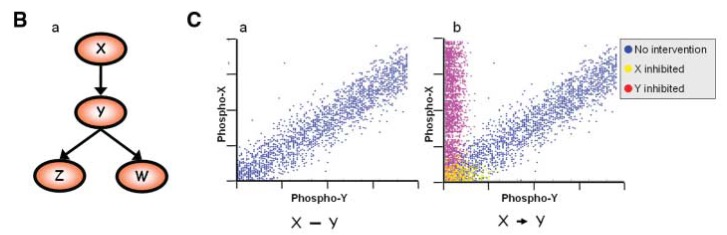

```{r set-options, echo=FALSE, cache=TRUE}
options(width = 100)
```
```{r setup, include=FALSE}
path = "~/Seminaires/SEEDED/BNtutorial/"
knitr::opts_chunk$set(echo = TRUE)
```

```{r, message=FALSE}

library(ggplot2)
library(reshape2)
library(Ckmeans.1d.dp)
library(corrplot)
library(bnlearn)
library(igraph)
library(knitr)
```

# Example 1 : Reproduce the networks of Sachs et al. (2005)

This dataset consists of single-cell cytometry data on 11 proteins in a primary T-cell signaling network, using normal condition ("observational") or perturbed conditions ("interventional").
<http://www.sciencemag.org/cgi/doi/10.1126/science.1105809>


## exploring the observational data

```{r}
sachs = read.table(file.path(path,'data','sachs.data.txt'),header=TRUE)

tmp = melt(sachs)
p = ggplot(tmp,aes(x=value, fill=variable, color=variable)) + 
    geom_density(alpha=0.30,size=0.7) + theme_bw() +
    facet_wrap(~variable, scales = "free") + labs(x="log2(value)")+
    theme(legend.title = element_blank(),
          panel.grid.major = element_blank(),
          panel.grid.minor = element_blank())

rm(tmp)
p
```


## Discretizing the data

We discretize the data, since it does not follow the assumption of normal distribution.

```{r sachs-discretize}
## discretize the data
dsachs = discretize(sachs,method='hartemink',breaks = 3, ibreaks = 60, idisc = 'quantile')

tmp=melt(dsachs,id.vars=c())
p = ggplot(tmp,aes(x=value, fill=variable, color=variable)) + 
    geom_bar() + theme_bw() +
    facet_wrap(~variable, scales = "free") + labs(x="Categories")+
    theme(legend.title = element_blank(),
          panel.grid.major = element_blank(),
          panel.grid.minor = element_blank()
          )

p
```

## Learning the BN from discretized data

```{r, cache = TRUE}
boot = boot.strength(data=dsachs, R=500,
                     algorithm='hc',
                     algorithm.args = list(score='bde', iss=10)
)

head(boot)
dim(boot)

## now threshold the edge strength and the direction evidence

boot.filt = boot[(boot$strength > 0.85 & boot$direction >= 0.5),]

dim(boot.filt)
boot.filt
```

## Averaging the network

We have learned 500 networks starting from different initial random networks; we can now average these networks.

```{r, cache = TRUE}
avg.boot = averaged.network(boot, threshold = 0.8)
net = avg.boot$arcs

net = graph_from_edgelist(net,directed=T)
library(Rgraphviz)

graphviz.plot(avg.boot)
```


## Use interventional data for Sachs

So far the network was built using observational data, i.e. data collected in normal conditions.
The dataset however contained additional interventional data, resulting from perturbation of specific nodes in the network. This data can either be used for validation (do the perturbation have the predicted effect from the initial network ?) or can be used to strengthen the evidence on the learned edges.




```{r, cache = TRUE}
isachs = read.table(file.path(path,'data',"sachs.interventional.txt"), header = TRUE, colClasses = "factor")

head(isachs)

INT = sapply(1:11, function(x) { which(isachs$INT == x) })

isachs2 = isachs[, 1:11]
nodes = names(isachs2)
names(INT) = nodes

## we start from a set of 200 random graphs
start = random.graph(nodes = nodes,  method = "melancon", num = 200, burn.in = 10^5, every = 100)

netlist = lapply(start, function(net) {
  tabu(isachs2, score = "mbde", exp = INT, iss = 1, start = net, tabu = 50) }
  )

arcs = custom.strength(netlist, nodes = nodes, cpdag = FALSE)

bn.mbde = averaged.network(arcs, threshold = 0.85)

net = bn.mbde$arcs
net = graph_from_edgelist(net,directed=T)

library(Rgraphviz)

graphviz.plot(bn.mbde)

```


# Example 2: building an epigenetic networks from CLL data

Here, we want to build a chromatin network where nodes are epigenetic components, and the observations are the state of these epigenetic modifications at the promoters of genes.

## Load pre-compiled epigenetic data matrix for CLL

```{r}
dat = read.table(paste0(path,"data/CEMT_26-nonCGI-allDataContinuous.txt"), 
                 header = TRUE, stringsAsFactors = FALSE, sep="\t")

head(dat)
dim(dat)

dat[,3:ncol(dat)] = round(dat[,3:ncol(dat)]/dat$Input,3)
dat = dat[,-ncol(dat)]

corVals = round(cor(dat, method="spearman"),2)
```

```{r, echo=F}
kable(corVals, caption = "Pairwise correlation values")
```


## Visualize how these epigenetic features are correlated
```{r}
corrplot.mixed(corVals, tl.col = "black", tl.cex=0.8)
```

## Visualize how these correlated features cluster together
```{r}
corrplot(corVals, order = "hclust", hclust.method = "ward.D2", addrect = 2, tl.col = "black");rm(corVals)
```

## Look at the distribution of the data
```{r}
summary(dat)

log2dat = log2(dat+0.1)
tmp = melt(log2dat)
p = ggplot(tmp,aes(x=value, fill=variable, color=variable)) + 
    geom_density(alpha=0.30,size=0.7) + theme_bw() +
    facet_wrap(~variable, scales = "free") + labs(x="log2(value)")+
    theme(legend.title = element_blank(),
          panel.grid.major = element_blank(),
          panel.grid.minor = element_blank())
rm(tmp)
p
```

## Perform discretization using Ckmeans.1d.dp

For details regarding Ckmeans.1d.dp, see <https://cran.r-project.org/web/packages/Ckmeans.1d.dp/vignettes/Ckmeans.1d.dp.html> 
Lets check the discrete states for H3K4me3 as an example

```{r}
res = Ckmeans.1d.dp(log2dat$H3K4me3)
# Number of clusters predicted
max(res$cluster)

# Lets look at the predictions
plot(log2dat$H3K4me3, col= res$cluster, cex=0.5, pch=20, xlab="Genes", ylab= "H3K4me3 signal")
#abline(h=res$centers, lwd=2,lty=2,col="blue")
rm(res)

# Compute optimal states for all
states = apply(log2dat, 2, function(y){max(Ckmeans.1d.dp(x=y, k=c(1,9))$cluster)})

# For methylation lots of states are predicted, from the distribution plots
# its clear that these are mostly intermediate states
# so lets approximate by taking 3 states

res = Ckmeans.1d.dp(log2dat$CPGfrac, k=c(1,3))
plot(log2dat$CPGfrac, col= res$cluster, cex=0.5, pch=20, xlab="Genes", ylab= "CPGfrac")
#abline(h=res$centers, lwd=2,lty=2,col="blue")

# We accept all the predicted states from Ckmeans.1d.dp except for methylation
# Final max discrete states are
states[1] = 3
states

# Creating the discretized version of the data
disDat = matrix(ncol=ncol(log2dat), nrow=nrow(log2dat))
colnames(disDat) = colnames(log2dat)
rownames(disDat) = rownames(log2dat)
disDat = as.data.frame(disDat)

for( i in 1: length(states))
{
  tmp = suppressWarnings(Ckmeans.1d.dp(log2dat[,i], k=c(1,states[i])))
  disDat[,i] = factor(tmp$cluster)
  rm(tmp)
}
rm(i, states)

# Final view of the discretized data
summary(disDat)

# Plot the discretized data
tmp=melt(disDat,id.vars=c())
p = ggplot(tmp,aes(x=value, fill=variable, color=variable)) + 
    geom_bar() + theme_bw() +
    facet_wrap(~variable, scales = "free") + labs(x="Categories")+
    theme(legend.title = element_blank(),
          panel.grid.major = element_blank(),
          panel.grid.minor = element_blank()
          )

p

```

## Learn bayesian network from the discretized data using bnlearn

We use a set of blacklist edges: no edge should go out of the expression node
```{r, cache = TRUE}

# Black list .. no interaction should originate from gene expression
bl=data.frame(from="RPKM",to=colnames(disDat))
bl=bl[-which(bl$to == "RPKM"),]

# Learn bayesian network via bootstrapping
strength = boot.strength(disDat, algorithm="tabu", 
                         algorithm.args=list(score="aic", tabu=10, blacklist=bl), 
                         R=1000) # takes about 2mins
rm(bl)

# Select only those interactions meeting our filteration criteria
selarcs = strength[strength$direction > 0.5 ,]
selarcs = selarcs[order(selarcs$strength,decreasing=TRUE),]
selarcs

# Get an averaged network
dag.average.filt = averaged.network(selarcs, threshold = 0.90)
```

```{r}
kable(dag.average.filt$arcs, caption = "Interactions meeting our threshold for strength and direction")
```

```{r}
# Compute correlations for the selected interactions
net = dag.average.filt$arcs
corVals = apply(net,1, function(x){
                                    a = log2dat[,x[1]]
                                    b = log2dat[,x[2]]
                                    c = round(cor(a,b,method="spearman"),2)
                                    return(c)
                                  })

# Coloring the correlation values
col = rep("forestgreen",nrow(net))
col[which(corVals < 0)] = "firebrick"

# Setting up the network in igraph
net = graph_from_edgelist(net,directed=T)
E(net)$weight = corVals
V(net)$label.color="black"
rm(corVals)
```


```{r, include=F}
#plot(net, edge.color=col, vertex.shape="none", edge.width=E(net)$weight*3.5)

#Identify vertex coordinates
l=layout_in_circle(net,order=c("H3K4me1", "H3K4me3", "RPKM", "H3K27ac", "H3K36me3", "H3K27me3", "CPGfrac", "H3K9me3"))
pos.grp <- which(V(net)$name %in% c("H3K4me1", "H3K4me3", "RPKM", "H3K27ac", "H3K36me3"))
neg.grp <- which(V(net)$name %in% c("H3K27me3", "CPGfrac", "H3K9me3"))

#Vertex color
V(net)$label.color[pos.grp]="#1f78b4"
V(net)$label.color[neg.grp]="#fdae61"
V(net)$label.font=2

#Vertex positioning
left.grp  <- which(V(net)$name %in% c("H3K4me1", "H3K4me3",  "H3K9me3")) 
right.grp <- which(V(net)$name %in% c("H3K27me3", "H3K27ac","H3K36me3"))
mid.grp   <- which(V(net)$name %in% c("RPKM", "CPGfrac"))

V(net)$label.dist = rep(NA,length(V(net)))
V(net)$label.degree = rep(NA,length(V(net)))

V(net)$label.dist[left.grp]=1.5
V(net)$label.degree[left.grp]=0
V(net)$label.dist[right.grp]=-1.5
V(net)$label.degree[right.grp]=0
V(net)$label.dist[mid.grp]= c(-0.3,0.3)
V(net)$label.degree[mid.grp]= -pi/2
```

## Plotting the bayesian network
```{r}
plot(net, edge.color=col, vertex.shape="circle", vertex.size = 40,layout=l, edge.width=E(net)$weight*3.5+3)
box();rm(col,l,pos.grp,neg.grp,left.grp,right.grp,mid.grp)
```

## Inference : making predictions using the network
```{r}
# Fitting the learnt network to the data to obtain
# conditional probability tables
fitted = bn.fit(dag.average.filt, disDat)


# Predict Expression level by setting DNAme to high/low
x.high = as.numeric(table(cpdist(fitted,nodes=c('RPKM'),CPGfrac=='3')))
x.low = as.numeric(table(cpdist(fitted,nodes=c('RPKM'),CPGfrac=='1')))

pred = data.frame(prop=c(x.high/sum(x.high),x.low/sum(x.low)),
                  condition=c(rep('DNAme high',length(x.high)),rep('DNAme low',length(x.high))),
                  Expression=c(1:length(x.high),1:length(x.low))
)

ggplot(pred,aes(x=Expression,fill=condition,y=prop)) + geom_bar(stat='identity',position=position_dodge())


```


```{r}
# Predict Expression level by setting H3K4me1 to high/low
x.high = as.numeric(table(cpdist(fitted,nodes=c('RPKM'),H3K4me1=='3')))
x.low = as.numeric(table(cpdist(fitted,nodes=c('RPKM'),H3K4me1=='1')))

pred = data.frame(prop=c(x.high/sum(x.high),x.low/sum(x.low)),
                  condition=c(rep('K4me1 high',length(x.high)),rep('K4me1 low',length(x.high))),
                  Expression=c(1:length(x.high),1:length(x.low))
)

ggplot(pred,aes(x=Expression,fill=condition,y=prop)) + geom_bar(stat='identity',position=position_dodge())

```
