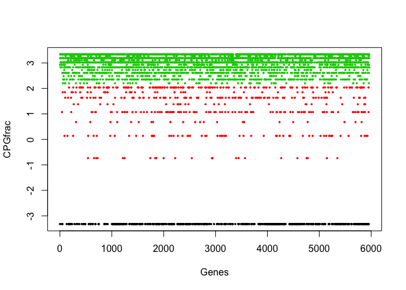

-   [Reproduce the networks of Sachs et al. (2005)](#reproduce-the-networks-of-sachs-et-al.-2005)
    -   [Average the network](#average-the-network)
    -   [use interventional data for Sachs](#use-interventional-data-for-sachs)
    -   [Load pre-compiled epigenetic data matrix for CLL](#load-pre-compiled-epigenetic-data-matrix-for-cll)
    -   [Look at the distribution of the data](#look-at-the-distribution-of-the-data)
    -   [Perform discretization using Ckmeans.1d.dp](#perform-discretization-using-ckmeans.1d.dp)
    -   [Learn bayesian network from the discretized data using bnlearn](#learn-bayesian-network-from-the-discretized-data-using-bnlearn)
    -   [Plotting the bayesian network](#plotting-the-bayesian-network)
    -   [Making predictions using the network](#making-predictions-using-the-network)

``` r
library(ggplot2)
library(reshape2)
library(Ckmeans.1d.dp)
library(corrplot)
library(bnlearn)
library(igraph)
library(knitr)
```

Reproduce the networks of Sachs et al. (2005)
---------------------------------------------

``` r
sachs = read.table(file.path(path,'data','sachs.data.txt'),header=TRUE)

tmp = melt(sachs)
```

    ## No id variables; using all as measure variables

``` r
p = ggplot(tmp,aes(x=value, fill=variable, color=variable)) + 
    geom_density(alpha=0.30,size=0.7) + theme_bw() +
    facet_wrap(~variable, scales = "free") + labs(x="log2(value)")+
    theme(legend.title = element_blank(),
          panel.grid.major = element_blank(),
          panel.grid.minor = element_blank())

rm(tmp)
p
```


``` r
## discretize the data
dsachs = discretize(sachs,method='hartemink',breaks = 3, ibreaks = 60, idisc = 'quantile')

tmp=melt(dsachs,id.vars=c())
```

    ## Warning: attributes are not identical across measure variables; they will be dropped

``` r
p = ggplot(tmp,aes(x=value, fill=variable, color=variable)) + 
    geom_bar() + theme_bw() +
    facet_wrap(~variable, scales = "free") + labs(x="Categories")+
    theme(legend.title = element_blank(),
          panel.grid.major = element_blank(),
          panel.grid.minor = element_blank()
          )

p
```

 \#\#\# Now learn the BN from the discretized data

``` r
boot = boot.strength(data=dsachs, R=500,
                     algorithm='hc',
                     algorithm.args = list(score='bde', iss=10)
)

head(boot)
```

    ##   from   to strength direction
    ## 1  Raf  Mek    1.000 0.5120000
    ## 2  Raf Plcg    0.232 0.4870690
    ## 3  Raf PIP2    0.036 0.4722222
    ## 4  Raf PIP3    0.018 0.5000000
    ## 5  Raf  Erk    0.006 0.5000000
    ## 6  Raf  Akt    0.016 0.7500000

``` r
dim(boot)
```

    ## [1] 110   4

``` r
## now threshold the edge strength and the direction evidence

boot.filt = boot[(boot$strength > 0.85 & boot$direction >= 0.5),]

dim(boot.filt)
```

    ## [1] 10  4

``` r
boot.filt
```

    ##     from   to strength direction
    ## 1    Raf  Mek    1.000 0.5120000
    ## 23  Plcg PIP2    1.000 0.5210000
    ## 24  Plcg PIP3    1.000 0.5230000
    ## 34  PIP2 PIP3    1.000 0.5090000
    ## 56   Erk  Akt    1.000 0.5680000
    ## 57   Erk  PKA    0.992 0.5786290
    ## 67   Akt  PKA    1.000 0.5750000
    ## 89   PKC  P38    1.000 0.5120000
    ## 90   PKC  Jnk    1.000 0.5160000
    ## 100  P38  Jnk    0.956 0.5115063

### Average the network

We have learned 500 networks starting from different initial random networks; we can now average these networks.

``` r
avg.boot = averaged.network(boot, threshold = 0.85)
net = avg.boot$arcs

net = graph_from_edgelist(net,directed=T)
library(Rgraphviz)
```

    ## Loading required package: graph

    ## Loading required package: BiocGenerics

    ## Loading required package: parallel

    ## 
    ## Attaching package: 'BiocGenerics'

    ## The following objects are masked from 'package:parallel':
    ## 
    ##     clusterApply, clusterApplyLB, clusterCall, clusterEvalQ, clusterExport, clusterMap,
    ##     parApply, parCapply, parLapply, parLapplyLB, parRapply, parSapply, parSapplyLB

    ## The following objects are masked from 'package:igraph':
    ## 
    ##     normalize, union

    ## The following object is masked from 'package:bnlearn':
    ## 
    ##     score

    ## The following objects are masked from 'package:stats':
    ## 
    ##     IQR, mad, xtabs

    ## The following objects are masked from 'package:base':
    ## 
    ##     anyDuplicated, append, as.data.frame, cbind, colnames, do.call, duplicated, eval,
    ##     evalq, Filter, Find, get, grep, grepl, intersect, is.unsorted, lapply, lengths, Map,
    ##     mapply, match, mget, order, paste, pmax, pmax.int, pmin, pmin.int, Position, rank,
    ##     rbind, Reduce, rownames, sapply, setdiff, sort, table, tapply, union, unique,
    ##     unsplit, which, which.max, which.min

    ## 
    ## Attaching package: 'graph'

    ## The following objects are masked from 'package:igraph':
    ## 
    ##     degree, edges, intersection

    ## The following objects are masked from 'package:bnlearn':
    ## 
    ##     degree, nodes, nodes<-

    ## Loading required package: grid

``` r
graphviz.plot(avg.boot)
```


### use interventional data for Sachs

``` r
isachs = read.table(file.path(path,'data',"sachs.interventional.txt"), header = TRUE, colClasses = "factor")


INT = sapply(1:11, function(x) { which(isachs$INT == x) })

isachs = isachs[, 1:11]
nodes = names(isachs)
names(INT) = nodes


start = random.graph(nodes = nodes,  method = "melancon", num = 200, burn.in = 10^5, every = 100)

netlist = lapply(start, function(net) {
  tabu(isachs, score = "mbde", exp = INT, iss = 1, start = net, tabu = 50) }
  )

arcs = custom.strength(netlist, nodes = nodes, cpdag = FALSE)

bn.mbde = averaged.network(arcs, threshold = 0.85)
```

### Load pre-compiled epigenetic data matrix for CLL

``` r
dat = read.table(paste0(path,"data/CEMT_26-nonCGI-allDataContinuous.txt"), 
                 header = TRUE, stringsAsFactors = FALSE, sep="\t")

head(dat)
```

    ##           CPGfrac RPKM H3K27ac H3K27me3 H3K36me3 H3K4me1 H3K4me3 H3K9me3 Input
    ## 10            7.5    0       7       19        8       7       6      14     9
    ## 10000         9.0    5      13        7       11      11       3      15     8
    ## 10001         0.0   19      10        8       11      28      77       5     3
    ## 10003         0.0    1      18       40       10      22       9      17    12
    ## 100033413    10.0    0      12       11       37       7       6      44    20
    ## 100033414    10.0    0      13       11       37       9       9      46    19

``` r
dim(dat)
```

    ## [1] 5964    9

``` r
dat[,3:ncol(dat)] = round(dat[,3:ncol(dat)]/dat$Input,3)
dat = dat[,-ncol(dat)]

corVals = round(cor(dat, method="spearman"),2)
```

|          |  CPGfrac|   RPKM|  H3K27ac|  H3K27me3|  H3K36me3|  H3K4me1|  H3K4me3|  H3K9me3|
|----------|--------:|------:|--------:|---------:|---------:|--------:|--------:|--------:|
| CPGfrac  |     1.00|  -0.06|    -0.36|     -0.17|      0.14|    -0.38|    -0.42|    -0.05|
| RPKM     |    -0.06|   1.00|     0.24|     -0.48|      0.03|     0.28|     0.20|    -0.36|
| H3K27ac  |    -0.36|   0.24|     1.00|      0.24|      0.43|     0.72|     0.72|     0.30|
| H3K27me3 |    -0.17|  -0.48|     0.24|      1.00|      0.37|     0.17|     0.28|     0.73|
| H3K36me3 |     0.14|   0.03|     0.43|      0.37|      1.00|     0.34|     0.40|     0.57|
| H3K4me1  |    -0.38|   0.28|     0.72|      0.17|      0.34|     1.00|     0.59|     0.16|
| H3K4me3  |    -0.42|   0.20|     0.72|      0.28|      0.40|     0.59|     1.00|     0.38|
| H3K9me3  |    -0.05|  -0.36|     0.30|      0.73|      0.57|     0.16|     0.38|     1.00|

#### Visualize how these epigenetic features are correlated

``` r
corrplot.mixed(corVals, tl.col = "black", tl.cex=0.8)
```


#### Visualize how these correlated features cluster together

``` r
corrplot(corVals, order = "hclust", hclust.method = "ward.D2", addrect = 2, tl.col = "black");rm(corVals)
```


### Look at the distribution of the data

``` r
summary(dat)
```

    ##     CPGfrac            RPKM             H3K27ac          H3K27me3         H3K36me3     
    ##  Min.   : 0.000   Min.   :   0.000   Min.   : 0.111   Min.   : 0.050   Min.   : 0.150  
    ##  1st Qu.: 5.000   1st Qu.:   0.000   1st Qu.: 0.762   1st Qu.: 0.643   1st Qu.: 0.611  
    ##  Median : 8.000   Median :   0.000   Median : 1.000   Median : 1.176   Median : 0.857  
    ##  Mean   : 6.829   Mean   :   6.139   Mean   : 1.783   Mean   : 2.071   Mean   : 1.693  
    ##  3rd Qu.: 9.000   3rd Qu.:   1.000   3rd Qu.: 1.750   3rd Qu.: 1.857   3rd Qu.: 1.556  
    ##  Max.   :10.000   Max.   :6557.000   Max.   :63.000   Max.   :42.000   Max.   :43.000  
    ##     H3K4me1          H3K4me3           H3K9me3      
    ##  Min.   : 0.077   Min.   :  0.083   Min.   : 0.053  
    ##  1st Qu.: 0.500   1st Qu.:  0.368   1st Qu.: 0.467  
    ##  Median : 0.857   Median :  0.500   Median : 0.722  
    ##  Mean   : 1.980   Mean   :  1.521   Mean   : 1.424  
    ##  3rd Qu.: 2.113   3rd Qu.:  1.093   3rd Qu.: 1.200  
    ##  Max.   :80.000   Max.   :104.000   Max.   :52.000

``` r
log2dat = log2(dat+0.1)
tmp = melt(log2dat)
```

    ## No id variables; using all as measure variables

``` r
p = ggplot(tmp,aes(x=value, fill=variable, color=variable)) + 
    geom_density(alpha=0.30,size=0.7) + theme_bw() +
    facet_wrap(~variable, scales = "free") + labs(x="log2(value)")+
    theme(legend.title = element_blank(),
          panel.grid.major = element_blank(),
          panel.grid.minor = element_blank())
rm(tmp)
p
```


### Perform discretization using Ckmeans.1d.dp

For details regarding Ckmeans.1d.dp, see <https://cran.r-project.org/web/packages/Ckmeans.1d.dp/vignettes/Ckmeans.1d.dp.html> Lets check the discrete states for H3K4me3 as an example

``` r
res = Ckmeans.1d.dp(log2dat$H3K4me3)
# Number of clusters predicted
max(res$cluster)
```

    ## [1] 3

``` r
# Lets look at the predictions
plot(log2dat$H3K4me3, col= res$cluster, cex=0.5, pch=20, xlab="Genes", ylab= "H3K4me3 signal")
abline(h=res$centers, lwd=2,lty=2,col="blue")
```


``` r
rm(res)

# Compute optimal states for all
states = apply(log2dat, 2, function(y){max(Ckmeans.1d.dp(x=y, k=c(1,9))$cluster)})
```

    ## Warning in cluster.1d.dp(x, k, y, method, estimate.k, "L2", deparse(substitute(x)), : Max number of clusters used. Consider increasing k!

``` r
# For methylation lots of states are predicted, from the distribution plots
# its clear that these are mostly intermediate states
# so lets approximate by taking 3 states

res = Ckmeans.1d.dp(log2dat$CPGfrac, k=c(1,3))
```

    ## Warning in cluster.1d.dp(x, k, y, method, estimate.k, "L2", deparse(substitute(x)), : Max number of clusters used. Consider increasing k!

``` r
plot(log2dat$CPGfrac, col= res$cluster, cex=0.5, pch=20, xlab="Genes", ylab= "CPGfrac")
abline(h=res$centers, lwd=2,lty=2,col="blue")
```



``` r
# We accept all the predicted states from Ckmeans.1d.dp except for methylation
# Final max discrete states are
states[1] = 3
states
```

    ##  CPGfrac     RPKM  H3K27ac H3K27me3 H3K36me3  H3K4me1  H3K4me3  H3K9me3 
    ##        3        6        2        3        3        3        3        2

``` r
# Creating the discretized version of the data
disDat = matrix(ncol=ncol(log2dat), nrow=nrow(log2dat))
colnames(disDat) = colnames(log2dat)
rownames(disDat) = rownames(log2dat)
disDat = as.data.frame(disDat)

for( i in 1: length(states))
{
  tmp = suppressWarnings(Ckmeans.1d.dp(log2dat[,i], k=c(1,states[i])))
  disDat[,i] = factor(tmp$cluster)
  rm(tmp)
}
rm(i, states)

# Final view of the discretized data
summary(disDat)
```

    ##  CPGfrac  RPKM     H3K27ac  H3K27me3 H3K36me3 H3K4me1  H3K4me3  H3K9me3 
    ##  1: 647   1:4382   1:4562   1:2133   1:3629   1:3396   1:3819   1:4890  
    ##  2: 519   2: 354   2:1402   2:3178   2:1743   2:1900   2:1189   2:1074  
    ##  3:4798   3: 394            3: 653   3: 592   3: 668   3: 956           
    ##           4: 420                                                        
    ##           5: 313                                                        
    ##           6: 101

### Learn bayesian network from the discretized data using bnlearn

``` r
# Black list .. no interaction should originate from gene expression
bl=data.frame(from="RPKM",to=colnames(disDat))
bl=bl[-which(bl$to == "RPKM"),]

# Learn bayesian network via bootstrapping
strength = boot.strength(disDat, algorithm="tabu", 
                         algorithm.args=list(score="aic", tabu=10, blacklist=bl), 
                         R=1000) # takes about 2mins
rm(bl)

# Select only those interactions meeting our filteration criteria
selarcs = strength[strength$direction > 0.5 ,]

# Get an averaged network
dag.average.filt = averaged.network(selarcs, threshold = 0.90)
```

``` r
kable(dag.average.filt$arcs, caption = "Interactions meeting our threshold for strength and direction")
```

| from     | to       |
|:---------|:---------|
| CPGfrac  | H3K27me3 |
| CPGfrac  | H3K4me1  |
| H3K27ac  | H3K27me3 |
| H3K27ac  | H3K36me3 |
| H3K27ac  | H3K4me1  |
| H3K27me3 | H3K36me3 |
| H3K27me3 | H3K9me3  |
| H3K27me3 | RPKM     |
| H3K36me3 | H3K4me1  |
| H3K36me3 | RPKM     |
| H3K4me3  | RPKM     |
| H3K9me3  | H3K36me3 |

``` r
# Compute correlations for the selected interactions
net = dag.average.filt$arcs
corVals = apply(net,1, function(x){
                                    a = log2dat[,x[1]]
                                    b = log2dat[,x[2]]
                                    c = round(cor(a,b,method="spearman"),2)
                                    return(c)
                                  })

# Coloring the correlation values
col = rep("firebrick",nrow(net))
col[which(corVals < 0)] = "forestgreen"

# Setting up the network in igraph
net = graph_from_edgelist(net,directed=T)
E(net)$weight = corVals
V(net)$label.color="black"
rm(corVals)
```

### Plotting the bayesian network

``` r
plot(net, edge.color=col, vertex.shape="none", layout=l, edge.width=E(net)$weight*3.5)
box();rm(col,l,pos.grp,neg.grp,left.grp,right.grp,mid.grp)
```


### Making predictions using the network

``` r
# Fitting the learnt network to the data to obtain
# conditional probability tables
fitted = bn.fit(dag.average.filt, disDat)

# Making the following prediction -
# Setting each node to either high or low w.r.t gene expression
# Calculating the feasibility probability
# Using all known interactions to gene expression

mat = matrix(ncol=4, nrow=14)
colnames(mat) = c("KnownEffectOnExp.","Variable","VariableState","ExpressionState")
mat = data.frame(mat, stringsAsFactors=F)

mat$KnownEffectOnExp. = c(rep("Negative",6), rep("Positive",8))
mat$Variable = c(
                  rep("CPGfrac",2), 
                  rep("H3K27me3",2),
                  rep("H3K9me3",2), 
                  rep("H3K27ac",2),
                  rep("H3K4me3",2), 
                  rep("H3K4me1",2),
                  rep("H3K36me3",2)
                )
mat$VariableState = c(3,1,3,1,2,1,1,2,1,3,1,3,1,3)
mat$ExpressionState = c(rep(c(1,6),7))

prob = apply(mat,1,function(x){
                                  cond1=paste0("(", x[2]," == ",x[3], ")")
                                  cond2=paste0("(", "RPKM"," == ",x[4], ")")
                                  cmd = paste0("cpquery(fitted,", cond1,"," , cond2, ")")
                                  p = eval(parse(text=cmd))
                                  return(p)
                              })
mat = cbind(mat,Probability=round(prob,2))
```

| KnownEffectOnExp. | Variable |  VariableState|  ExpressionState|  Probability|
|:------------------|:---------|--------------:|----------------:|------------:|
| Negative          | CPGfrac  |              3|                1|         0.80|
| Negative          | CPGfrac  |              1|                6|         0.11|
| Negative          | H3K27me3 |              3|                1|         0.10|
| Negative          | H3K27me3 |              1|                6|         0.57|
| Negative          | H3K9me3  |              2|                1|         0.17|
| Negative          | H3K9me3  |              1|                6|         0.86|
| Positive          | H3K27ac  |              1|                1|         0.80|
| Positive          | H3K27ac  |              2|                6|         0.25|
| Positive          | H3K4me3  |              1|                1|         0.70|
| Positive          | H3K4me3  |              3|                6|         0.79|
| Positive          | H3K4me1  |              1|                1|         0.57|
| Positive          | H3K4me1  |              3|                6|         0.08|
| Positive          | H3K36me3 |              1|                1|         0.64|
| Positive          | H3K36me3 |              3|                6|         0.04|
